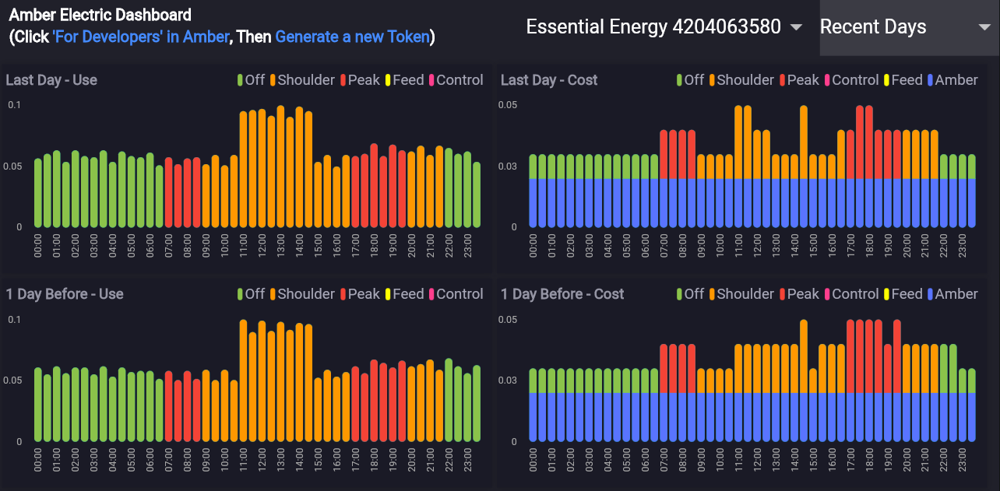

[Visualise your Amber Electric electricity consumption](https://amberelectric.codemagic.app/)
using this flutter dashboard. It's available on
[web](https://amberelectric.codemagic.app/),
[Android](https://play.google.com/store/apps/details?id=au.com.bitbot.amber), and
[iOS/iPhone](https://apps.apple.com/au/app/amber-dashboard/id6462788425).
It can be built and packaged for Linux and Windows also if anybody requires that, but I'd need to automate the relevant store uploads.

[Amber Electric Dashboard](https://amberelectric.codemagic.app/) is not affiliated
with [Amber Electric](https://www.amber.com.au/) other than we are a customer of their
electricity services. The name Amber Electric is their trademark.

You can make suggestions regarding [this app here](https://github.com/bradrushworth/amber/issues).
You can make suggestions to the [Amber Electric company here](https://github.com/amberelectric/public-api/discussions).

Feel free to [buy Brad a coffee](https://www.buymeacoffee.com/bitbot) if you thought this dashboard
was useful to you. Feedback welcome also.
