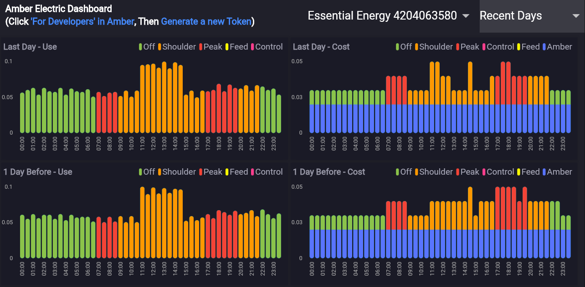

# Amber Electric Dashboard

[Visualise your Amber Electric electricity consumption](https://amberelectric.codemagic.app/)
using this flutter dashboard. It's available on
[web](https://amberelectric.codemagic.app/),
[Android](https://play.google.com/store/apps/details?id=au.com.bitbot.amber), and
[iOS/iPhone](https://apps.apple.com/au/app/amber-dashboard/id6462788425).
It can be built and packaged for Linux and Windows also if anybody requires that, but I'd need to automate the relevant store uploads.

You can make suggestions regarding [this app here](https://github.com/bradrushworth/amber/issues).
You can make suggestions to the [Amber Electric company here](https://github.com/amberelectric/public-api/discussions).

Feel free to [buy Brad a coffee](https://www.buymeacoffee.com/bitbot) if you thought this dashboard
was useful to you. Feedback welcome also.

## About Amber Electric

[Amber Electric](https://amber.com.au/) is an innovative energy retailer in
Australia which gives customers access to the wholesale energy price as
determined by the National Energy Market.

This gives customers the opportunity to reduce their bills and their reliance
on fossil fuels by shifting their biggest energy usage to times of the day when
energy is cheaper and greener.

### Amber's API

Amber gives customers access to a LOT of their own data through their public
Application Programming Interface or API.

This tool relies on you having access to Amber's API, which means you need
to be an Amber customer, and you need to get an API token.
But that's pretty easy.
[Start here](https://help.amber.com.au/hc/en-us/articles/360038985552-Do-you-have-an-API-).

Amber has started to support 5 minute billing periods now for some customers.
The app should be able to automatically detect and support all users regardless of whether
they are on 30 minute or 5 minute billing periods.

Regardless of the billing period, the dashboard charts are drawn as **fixed
half-hour bars** (2 bars per hour, 48 bars per day). For a site on a 5 minute
billing period, its six 5-minute intervals are **summed into each half-hour
bar**, so one bar shows the total of 6 x 5-minute kWh (or cost) values.
30 minute sites contribute one interval per bar. This aggregation is
implemented in `DataAggregator.aggregateData` in `lib/bar_chart.dart`.

### Affiliations

[Amber Electric Dashboard](https://amberelectric.codemagic.app/) is not affiliated
with [Amber Electric](https://www.amber.com.au/) other than we are a customer of their
electricity services. The name Amber Electric is their trademark.

## Development

This is a standard Flutter project.

- Install dependencies: `flutter pub get`
- Run the tests: `flutter test` (aggregation logic, including 30 and 5 minute
  scenarios, is covered in `test/bar_chart_test.dart`)
- Static analysis: `flutter analyze`

The chart aggregation lives in `lib/bar_chart.dart` (`DataAggregator`) and the
screens are assembled in `lib/main.dart`. The `Usage` data model is in
`lib/model/Usage.dart`.

## Building and deploying

There is no local deploy script. Builds and releases are automated with
[Codemagic](https://amberelectric.codemagic.app/). Pushing to the `master`
branch triggers the Codemagic pipeline, which builds and publishes the web,
Android and iOS versions.

## Versioning

The version is defined in `pubspec.yaml` as `version: x.y.z+build`
(e.g. `0.5.2+41`). Minor version bumps and a sequentially increasing build
number follow the existing commit history convention.

## Disclaimer and Licence

While all attempts are made to ensure Amber Electric Dashboard is accurate, no guarantees
are made regarding its accuracy or correctness.

Amber Electric Dashboard code is shared under [licence](https://github.com/bradrushworth/amber/blob/master/LICENSE).
